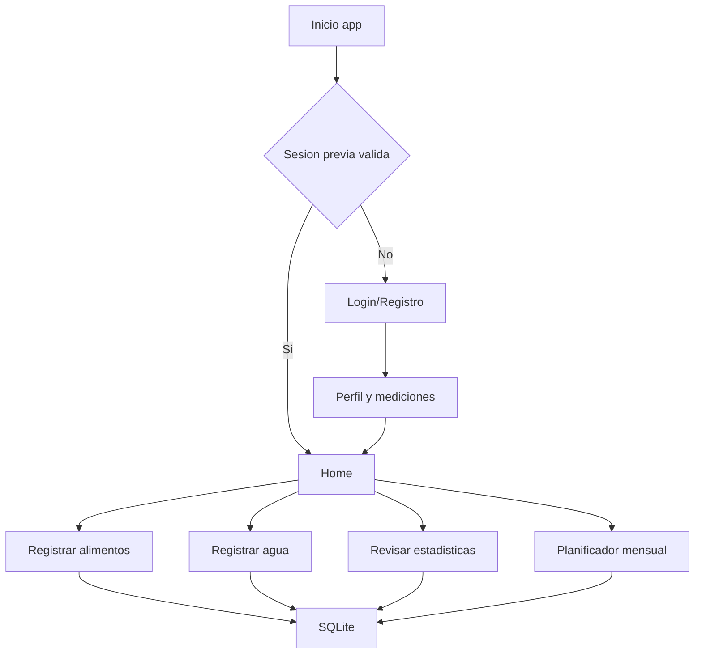
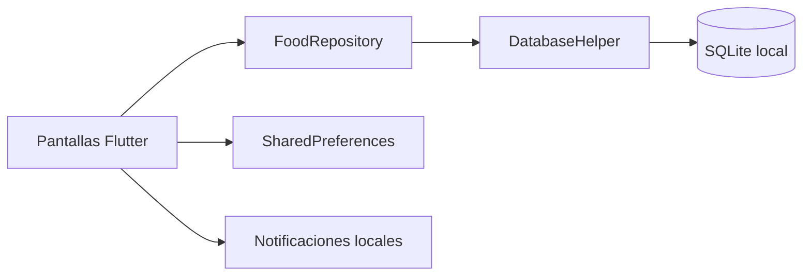

# Bloque de Nota para Registro - VerdeMeta

Fecha: 09 de abril de 2026  
Aplicacion: VerdeMeta  
Canal de instalacion principal: Google Play

---

## 1. Manual de Usuario

### 1.1 Guia de Instalacion y Acceso

#### Opcion oficial (Google Play)
1. Abrir Google Play Store en el dispositivo Android.
2. Buscar la aplicacion: VerdeMeta.
3. Verificar identidad visual (logo y nombre del desarrollador publicado).
4. Pulsar Instalar.
5. Abrir la app desde el boton Abrir o desde el icono en pantalla de inicio.

#### Primer acceso
1. En la pantalla inicial, seleccionar Crear cuenta o Iniciar sesion.
2. Registrar usuario y contrasena (almacenamiento local en SQLite).
3. Completar el formulario de mediciones corporales.
4. Entrar al panel principal (Home) para comenzar el registro diario.

#### Requisitos minimos recomendados
- Dispositivo Android compatible con Google Play.
- Conexion a Internet para descarga e instalacion inicial desde Play Store.
- Espacio libre para instalar la app y guardar base de datos local.
- Conexion opcional para funciones de consulta/expansion de catalogo asistidas por IA.

#### Disponibilidad web
- Existe una variante web de desarrollo, pero para persistencia completa de datos y experiencia final de usuario, la instalacion recomendada es Android por Google Play.

### 1.2 Interfaz y Navegacion

#### Pantallas principales
1. Login/Registro:
- Acceso con usuario y contrasena.
- Cambio de idioma (es/en) y modo visual (claro/oscuro).
- Restauracion automatica de sesion previa.

2. Perfil y mediciones:
- Captura de datos base (edad, peso, altura, objetivo, actividad).
- Captura de perimetros corporales (cintura, cuello, cadera, etc.).
- Calculo y guardado de objetivos nutricionales diarios.

3. Home (panel diario):
- Resumen de calorias y macronutrientes del dia.
- Alimentos rapidos para registro inmediato.
- Registro de ingesta de agua.
- Estadisticas semanales y tendencias.
- Accesos al planificador mensual y recetas del dia.

4. Menu de acciones:
- Configuracion de apariencia.
- Mediciones/perfil.
- Cerrar sesion.

#### Flujo de navegacion
1. Apertura app -> Login/Registro.
2. Si usuario nuevo -> Perfil y mediciones.
3. Perfil guardado -> Home.
4. Desde Home -> registro de comidas, agua, metricas, planificacion.
5. Cierre de sesion -> vuelve a Login.

### 1.3 Instrucciones Operativas (paso a paso)

#### A. Crear cuenta y preparar el perfil
1. Abrir la app.
2. Pulsar Crear cuenta.
3. Escribir usuario y contrasena.
4. Confirmar contrasena.
5. Completar formulario de mediciones.
6. Guardar.
7. Entrar al Home.

#### B. Iniciar sesion
1. Abrir la app.
2. Escribir usuario y contrasena.
3. Pulsar Iniciar sesion.
4. Si habia sesion valida previa, el acceso puede ser automatico.

#### C. Registrar un alimento consumido
1. Desde Home, abrir el registro de alimentos.
2. Buscar alimento por nombre o seleccionar alimento rapido.
3. Indicar cantidad consumida.
4. Seleccionar momento del dia (desayuno, almuerzo, cena o merienda).
5. Confirmar guardado.
6. Verificar que el alimento aparece en el log diario y que los totales se actualizan.

#### D. Registrar consumo de agua
1. Entrar a la seccion de agua en Home.
2. Agregar o ajustar vasos consumidos.
3. Confirmar.
4. Validar actualizacion en el resumen diario/semanal.

#### E. Revisar progreso diario y semanal
1. Abrir Home.
2. Revisar tarjetas de calorias y macronutrientes.
3. Consultar graficos semanales de tendencia.
4. Identificar desviaciones respecto a objetivos.

#### F. Planificacion mensual de dieta
1. Entrar al modulo de planificacion.
2. Elegir mes y parametros.
3. Generar o editar plan diario.
4. Validar sugerencias de balance nutricional.
5. Guardar plan mensual.

#### G. Cerrar sesion
1. Abrir menu de usuario en Home.
2. Pulsar Cerrar sesion.
3. Confirmar retorno a pantalla de login.

---

## 2. Descripcion de Funciones (Memoria Descriptiva)

### 2.1 Objetivo General
VerdeMeta es una aplicacion de seguimiento nutricional enfocada en alimentacion vegana. Resuelve la necesidad de registrar consumo diario, controlar macronutrientes, monitorear hidratacion y apoyar la planificacion alimentaria con una experiencia local, rapida y usable en Android. Esta dirigida a usuarios que desean control de su dieta y composicion corporal, asi como a personas con metas de salud especificas.

### 2.2 Arquitectura del Software

#### Stack principal
- Lenguaje: Dart.
- Framework: Flutter.
- Estado/UI: Material 3 + Riverpod/Provider.
- Base de datos local: SQLite (Sqflite).
- Persistencia de preferencias de interfaz/sesion: SharedPreferences.
- Graficos: fl_chart.
- Notificaciones: flutter_local_notifications.

#### Entorno de ejecucion
- Plataforma principal objetivo: Android (distribucion en Google Play).
- Motor de ejecucion: Flutter Engine (renderizado movil).
- Almacenamiento local por usuario para uso offline-first.

#### Persistencia de datos
- Tablas principales: foods, food_aliases, food_log, user_profile/user_profiles, water_log, ai_learned_foods.
- El repositorio de datos centraliza autenticacion, consultas nutricionales, log diario, perfil y resumenes.

### 2.3 Modulos Funcionales

1. Modulo de Autenticacion y Sesion
- Registro de usuario local.
- Inicio de sesion.
- Restauracion de sesion guardada.
- Cierre de sesion y limpieza de estado.

2. Modulo de Perfil y Mediciones
- Captura de datos antropometricos.
- Seleccion de objetivo nutricional.
- Estimacion de composicion corporal.
- Persistencia del perfil del usuario.

3. Modulo de Catalogo y Busqueda de Alimentos
- Catalogo de alimentos veganos.
- Busqueda inteligente por nombre y alias/sinonimos.
- Acceso a alimentos rapidos para carga inmediata.

4. Modulo de Registro Diario de Comidas
- Registro por comida (desayuno, almuerzo, cena, merienda).
- Cantidad consumida.
- Calculo de calorias y macros por porcion.
- Historial del dia.

5. Modulo de Hidratacion
- Registro de vasos de agua por dia.
- Integracion con panel de progreso.

6. Modulo de Analitica y Reporte de Progreso
- Totales diarios.
- Tendencias semanales.
- Visualizacion de avance frente a objetivos.

7. Modulo de Planificador Mensual y Recetas
- Generacion/edicion de plan alimentario mensual.
- Validacion nutricional del plan.
- Vistas de recetas o sugerencias del dia.

8. Modulo de Notificaciones
- Inicializacion de notificaciones locales.
- Recordatorios de objetivos diarios de macros.

### 2.4 Algoritmos Principales (logica funcional)

1. Autenticacion local con hash
- Entrada: usuario + contrasena.
- Proceso: normalizacion y hash SHA-256 de contrasena.
- Salida: acceso permitido/denegado y contexto de usuario activo.

2. Calculo nutricional por porcion
- Entrada: valores nutricionales por 100g + gramos consumidos.
- Proceso: regla proporcional para calorias y macros.
- Salida: aporte real del registro agregado al total diario.

3. Rollover diario y cierre de resumen
- Entrada: fecha actual y ultimo dia activo del usuario.
- Proceso: detectar cambio de dia y consolidar resumen del dia anterior.
- Salida: tabla de resumen diario actualizada y estado diario renovado.

4. Busqueda inteligente de alimentos
- Entrada: texto de busqueda.
- Proceso: consulta en nombre principal y tabla de alias.
- Salida: lista de coincidencias relevantes para registro rapido.

5. Estimacion de composicion corporal
- Entrada: peso, talla, edad, sexo y perimetros corporales.
- Proceso: calculo de IMC, categorias y estimaciones de grasa/masa magra/agua.
- Salida: metricas de composicion para seguimiento.

6. Validacion y rebalanceo de plan diario/mensual
- Entrada: metas de macros + propuesta de comidas.
- Proceso: validacion de desviaciones y sugerencias de ajuste.
- Salida: plan nutricional mas consistente con objetivo.

### 2.5 Diagramas de Flujo

#### Flujo principal de usuario

#### Flujo de datos interno (arquitectura)

---

## 3. Material Grafico Complementario

### 3.1 Capturas de Pantalla requeridas para expediente
Tomar y anexar capturas en formato PNG/JPG de las siguientes vistas, mostrando logo y elementos de marca:
1. Pantalla de Login/Registro.
2. Pantalla de Perfil y mediciones.
3. Pantalla Home con resumen diario.
4. Pantalla de registro de alimento (busqueda + cantidad + comida).
5. Pantalla de estadisticas/graficos.
6. Pantalla de planificacion mensual.
7. Menu/configuracion (idioma y tema).
8. Pantalla de receta del dia (si aplica en build final).

Recomendacion tecnica para capturas:
- Resolucion sugerida: 1080 x 1920 (vertical).
- Sin datos sensibles reales.
- Mantener consistencia visual (mismo idioma y tema para toda la serie).

### 3.2 Diseno de Interfaz (UI)

#### Identidad visual
- Marca: VerdeMeta.
- Estilo: saludable, limpio, orientado a bienestar.
- Iconografia y logo incluidos en assets del proyecto.

#### Paleta cromatica (base observada)
- Verde principal: enfoque en salud y nutricion.
- Fondos claros con contrastes suaves.
- Variante de tema oscuro disponible.

#### Tipografia
- Tipografia configurada para una lectura moderna y clara (PlusJakartaSans como familia principal en la app).

#### Disposicion grafica
- Navegacion por pantallas con jerarquia clara: acceso, configuracion de perfil, panel diario y modulos especializados.
- Tarjetas/resumenes para KPIs diarios.
- Componentes de accion rapida para registro de comida y agua.

---

## Anexo recomendado para presentacion legal

1. Incluir este documento como Memoria Funcional + Manual de Usuario.
2. Adjuntar PDF con capturas numeradas en el mismo orden de la seccion 3.1.
3. Adjuntar icono oficial y logo usados en Play Store.
4. Adjuntar ficha de version publicada (numero de version y fecha).
5. Adjuntar enlace o evidencia de publicacion en Google Play Console cuando este activa.

---

Documento elaborado para fines de registro y evaluacion tecnico-funcional de software.
